<div align="center">
  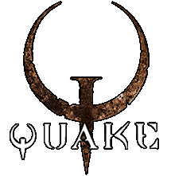
  <h1>Quake Emacs</h1>
  <p>Lean, fast, focused, and based on the latest Emacs tech</p>
</div>

<p align="center">
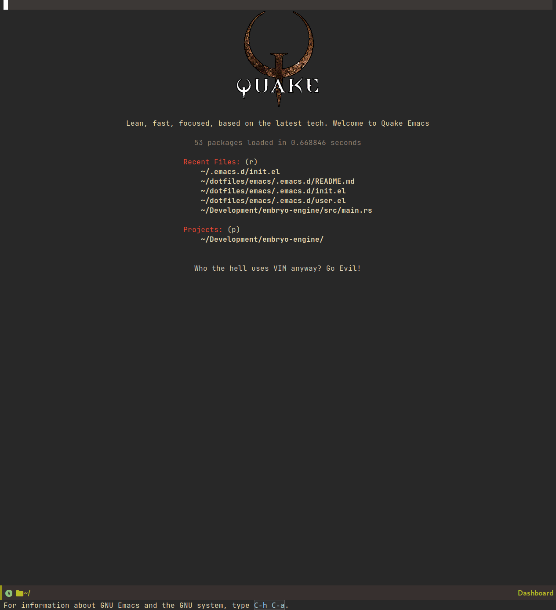
</p>

---

## Why?

If you want to use Emacs, but you:

1. just want to sit down and have your new text editor work well and look good *right away*, and
2. don't want the complexity, abstraction, and lack of documentation of a larger Emacs distribution or configuration framework,

then Quake Emacs is for you.

Text editors are most often used for three core tasks: **code editing**, **writing**, and **note-taking**. Quake Emacs is a single-file Emacs distribution architected around those three fundamental tasks, aiming to provide a lean, fast, focused, and complete experience for all three right out of the box, while remaining as simple and vanilla as possible, so you can use it as a great foundation for bare-metal Emacs configuration.

## How to install

1. First, you install Quake Emacs like usual:

```bash
git clone https://github.com/alexispurslane/quake-emacs.git ~/.emacs.d
```

2. Then copy the example `user.el` provided with Quake to your Quake Emacs configuration directory at `~/.quake.d/user.el`:

```bash
mkdir -p ~/.quake.d/ && cp user.el ~/.quake.d/
```

To update, just `git pull` to the latest tag. I recommend you check the release notes for the tag for any tips, known issues to avoid, etc.

## Key Features

- 🎯 **Lean and focused**: Quake Emacs includes just the packages and configuration you need for a beautiful, modern IDE-lite experience when coding and a focused, ergonomic experience when writing or taking notes, and *nothing else*. It even completely does away with the need for language-specific layers through the use of tree-sitter and LSP support. Consider Quake Emacs part of your editor — it's just there to give you a good out of the box experience, like [Helix](https://helix-editor.com/). The rest is up to you! 
- 🚀 **Fast**: On my machine, Quake Emacs loads in 0.58 seconds on average. Every single package is carefully chosen with performance in mind, and the default load order is tuned obsessively to ensure Emacs starts as fast as possible. Enjoy fast startup times, or use it as extra headroom to add your own packages.
- 🥇 **Just one single file**: The configuration framework itself is only one simple, extensively documented, self-contained 1000-line file. That's it. Just put the file in your Emacs directory and go. No external commands, no multiple thousands of lines of Lisp scattered throughout hundreds of files across interminable layers of abstraction. If you want to know where something is, or how it works, it's easy to find.
- 🌐 **Modern and vanilla**: Despite having an opinionated UX out of the box, Quake Emacs prioritizes using Emacs's built-in capabilities as much as possible under the hood, and when those fail, using packages that integrate well with that existing Emacs functionality and leverage it strategically wherever possible. Quake Emacs only introduces layers of abstraction over built-in vanilla Emacs when *absolutely necessary*. Vanilla Emacs instructions should still work in Quake Emacs!

## Showcase

### Code Editing

Quake Emacs has fuzzy autocompletion with [Corfu](https://elpa.gnu.org/packages/doc/corfu.html) and Orderless enabled everywhere.

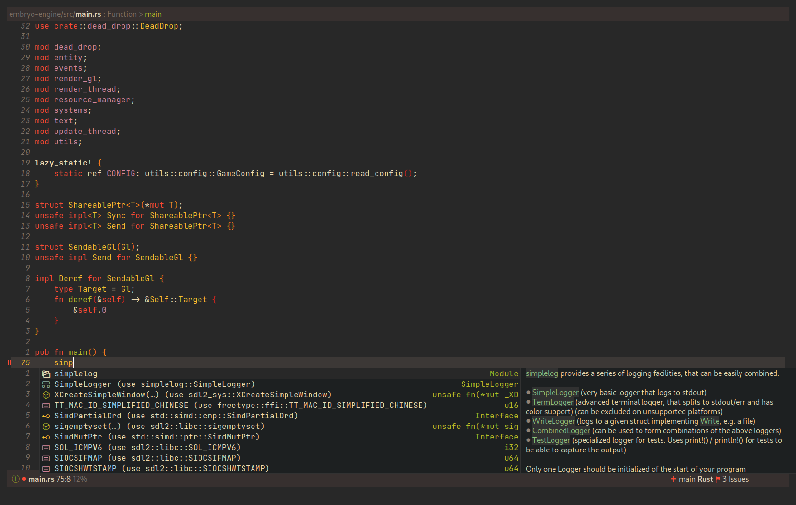

Full autocompletion even works in the Lisp Eval line (`M-:`). It's a real repl, so why not have a real coding experience in it?

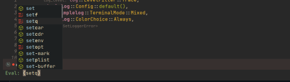

Fuzzy searching with [Vertico](https://github.com/minad/vertico), [Marginalia](https://github.com/minad/marginalia), [Consult](https://github.com/minad/consult) and [Orderless](https://github.com/oantolin/orderless) is enabled in every selection menu and prompt. 

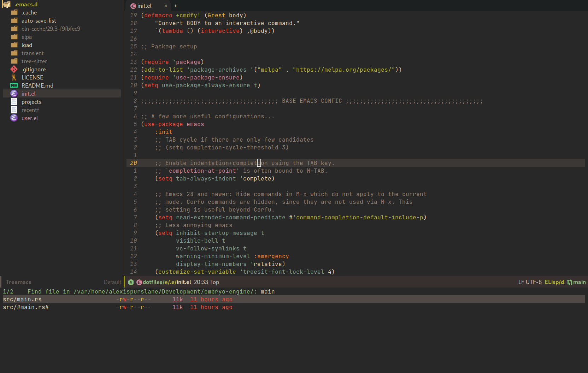

Quake Emacs has an optionally pretty rich GUI with inclusion of [Centaur Tabs](https://github.com/ema2159/centaur-tabs) and [Treemacs](https://github.com/Alexander-Miller/treemacs) (only loaded when requested, so if you don't use them, you don't pay for them), both configured to look their best. (Also notice [hydra](https://github.com/abo-abo/hydra?tab=readme-ov-file), [which-key](https://github.com/abo-abo/hydra?tab=readme-ov-file), and my meticulous [evil-mode](https://github.com/emacs-evil/evil) leader key keybindings, made with [general](https://github.com/noctuid/general.el)).

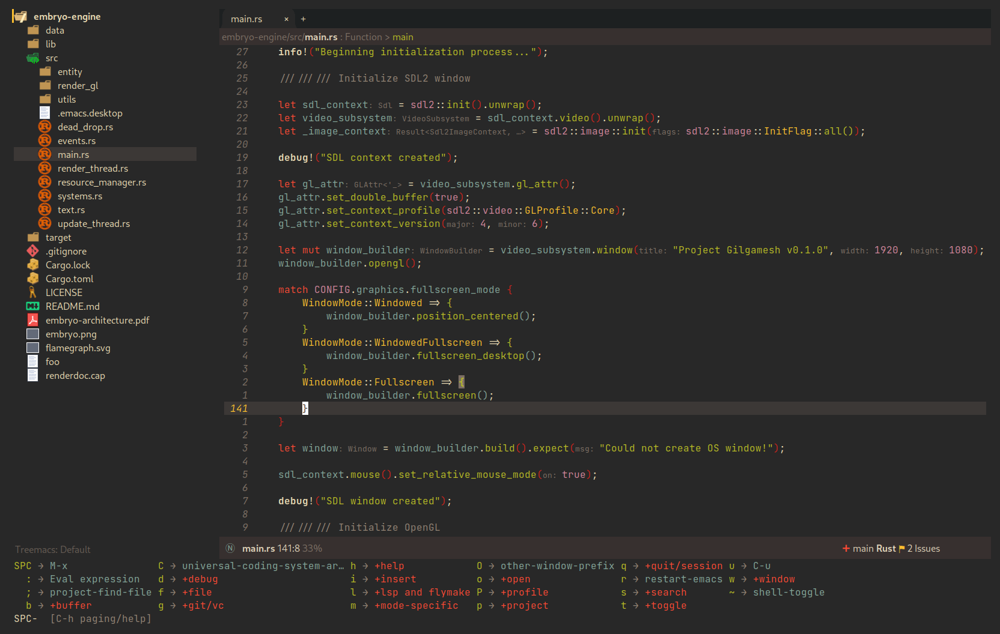

But Quake Emacs is also minimal and focused by default, if you prefer.

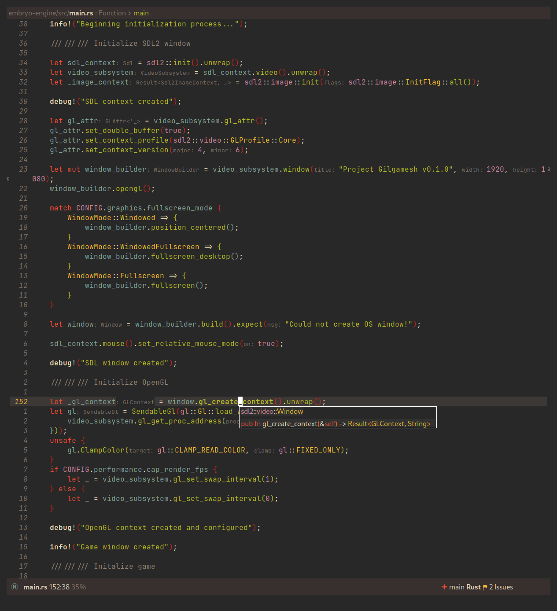

While also offering IDE-class features besides completion, via [Eglot](https://github.com/joaotavora/eglot), [eldoc-box](https://github.com/casouri/eldoc-box), [tree-sitter](https://www.emacswiki.org/emacs/Tree-sitter), and [treesit-auto](https://github.com/renzmann/treesit-auto).


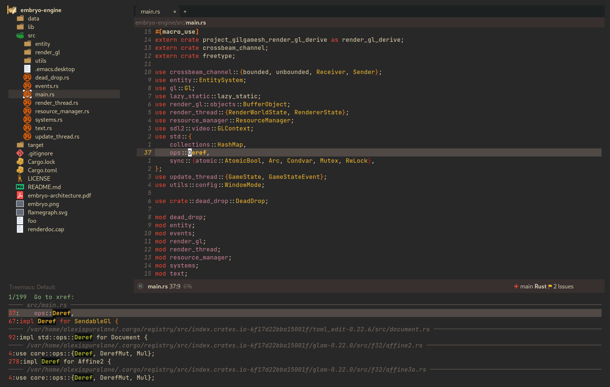
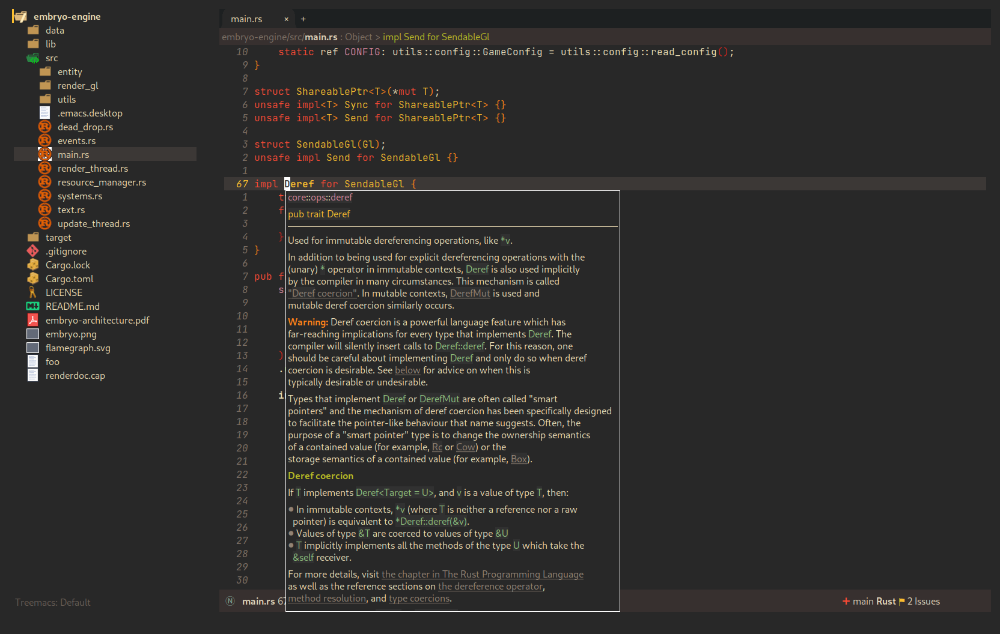

And, Quake Emacs wouldn't be able to live up to its name unless it had a classic Quake-style popup terminal! So here it is, implemented entirely without any external packages, and bound to `SPC ~`:


### Writing

For those of you who prefer to write your prose in Emacs, I've also created an excellent writing mode, which switches to [a variable pitch font](https://github.com/iaolo/iA-Fonts/tree/master) of your choice, enables a [distraction-free writing mode](https://github.com/joaotavora/darkroom), enables [visual fill column mode](https://github.com/joostkremers/visual-fill-column), wrapped at 65 characters, so that lines behave pleasingly like in a WYSIWYG editor, and enables a flymake [proselint](https://github.com/amperser/proselint) backend to help you improve your prose. To enable all of that, just use `SPC o d`! Here's a sneak peak:

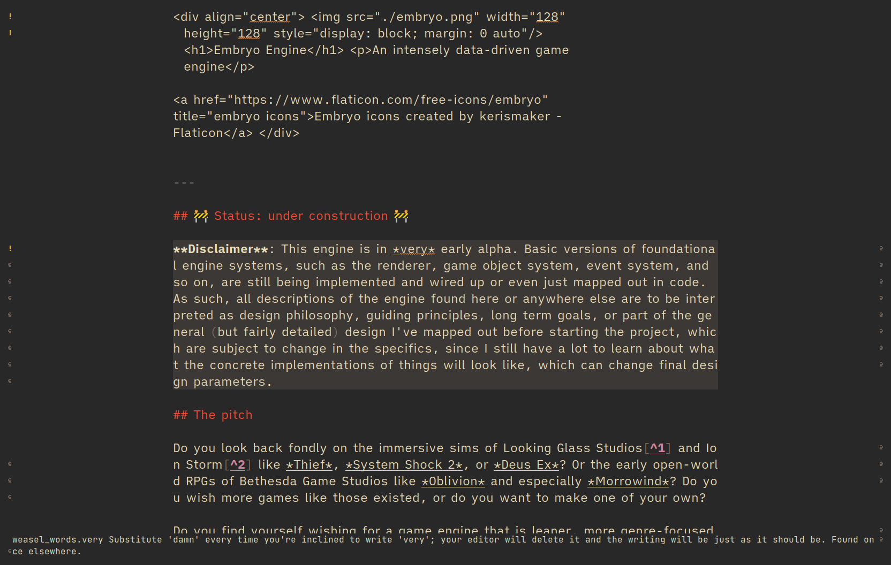

### Note-taking

For those that want Emacs to serve as their second brain, Quake Emacs uses [Denote](https://protesilaos.com/emacs/denote), a lightweight personal hypertext information manager that can incorporate an extensible list of markup languages (*not just org*), external files (links to and from, including buttonization as a minor-mode), and even non-text-markup files (such as PDFs, images, or code files like iPython Notebooks) directly into its linking and searching system. It offers all of the same basic features as `org-roam` without locking you down to using only Org, or requiring you to use an SQLite database, while also offering optional excellent integration with org if you want it. It also makes deep use of existing Emacs built-ins, as well as integrating explicitly with packages like vertico, marginalia, and consult via [consult-notes](https://github.com/mclear-tools/consult-notes). I've even created a set of convenient leader key keybinds for managing it.

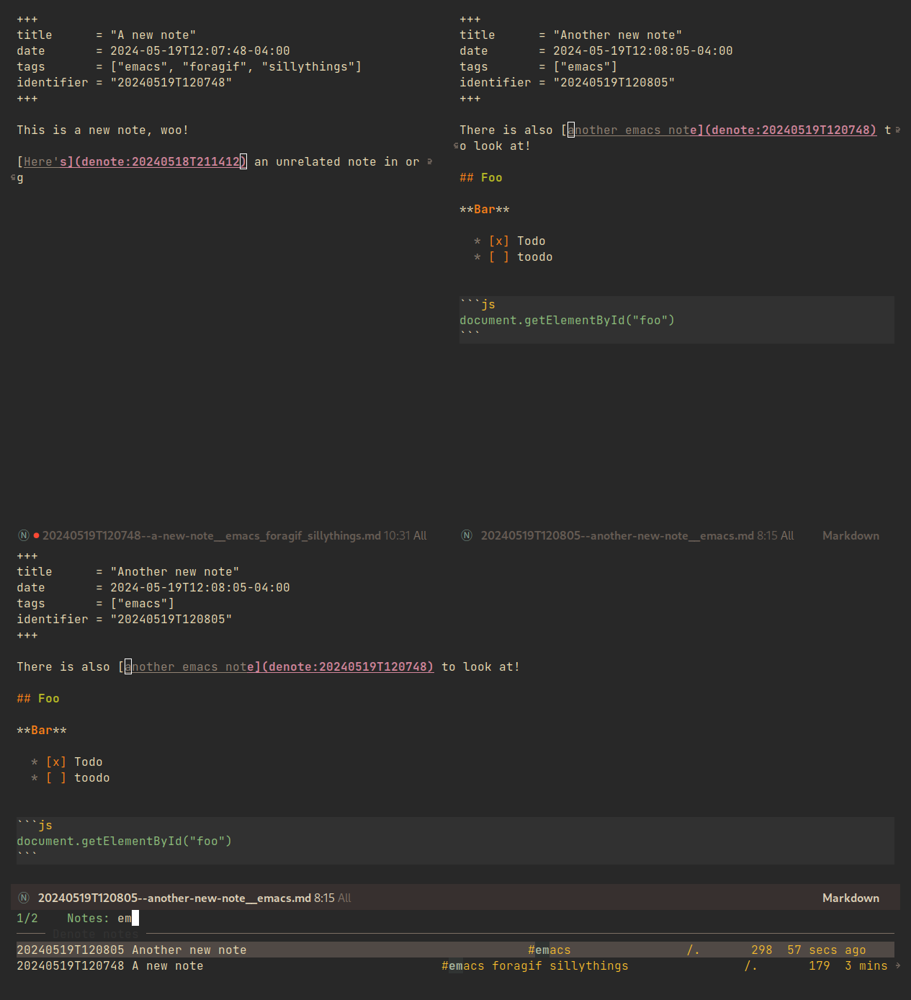

## Justification

With the introduction of various modern Emacs features in the last few years, and the emergence of a new generation of Emacs packages focused on integrating with vanilla Emacs, Emacs distributions as we have known them are less and less relevant.

Now that `use-package` is included with Emacs by default, configuration frameworks are less necessary then ever, as vanilla Emacs's built-in capabilities are likely clearer, faster, and more powerful than whatever a configuration framework could offer, with the benefit of also being the community standard. In my experience, Doom Emacs's ideosyncratic package management system was less clear, less-organized, less-documented, and much less reliable than what is now built into Emacs 29.

Likewise, with the inclusion of `eglot` and `tree-sitter`, language-specific "layers" that compose five or six packages, together with a lot of configuration, in order to give a decent experience, are mostly a thing of the past. Quake Emacs leverages these powerful built-in modern Emacs features to give you the experience of an Emacs configuration framework and distribution, without all the downsides.

Similarly, with the creation of amazing packages like `vertico`, `orderless`, and `corfu`, the need to manually integrate added features from various packages into your Emacs system and other Emacs packages is basically obsolete: these packages integrate directly with Emacs, by hooking into or outright replacing Emacs's built in functions for performing various actions, so there's no need to do anything. As a result, much of the configuration work Emacs distributions needed to do to wire everything up simply doesn't need to be done.

## Inspiration and Prior Art

### Doom Emacs

[DOOM Emacs](https://github.com/doomemacs/doomemacs) was my previous (and fallback) daily driver. It is an excellent Emacs distribution and piece of software, but essentially its own editor in many ways. Still what I would probably recommend to a newbie until Quake hypothetically becomes stable and mature.

#### Points of similarity:

1. Extensive evil mode support and integration, allowing you to control your editor entirely from Vim-style leader key combinations, and integrating evil mode into every other mode and package installed.
2. Opinionated and aesthetically pleasing defaults to try to make Emacs look and feel, not like another editor like VSCode, but like a *modern Emacs* — unique, but not recalcitrant.
3. Obsessive attention to performance, because one of the main benefits of Emacs is providing a powerful editing experience comparable or vastly superior to something like VSCode, while still relatively having the performance and lightweight footprint of a terminal application.

#### Differences:

1. Doesn't install nearly as many packages and does fewer (no) ideosyncratic things. This gives you less of a complete experience you aren't supposed to tinker with besides toggling layers, and more of a comfortable and usable-out-of-the-box, but relatively simple and straightforward, foundation to build from.
2. Has no "alternate" layers to achieve the same functionality in different ways (e.g. helm vs ivy vs vertico). There is one blessed set of packages, to avoid the combinatorial explosion of complexity that brings.
3. Will not have any layers, packages, and configuration available or installed for anything outside of making what I consider core text editor functionality nice to use (so nothing for mail, no vterm, etc).
4. Offers no customization framework or anything bespoke, only Vanilla Emacs constructs.
5. Fully adopts modern Emacs features, including `treesit`, `eglot`, `use-package`, and even `electric-pair` (Doom Emacs is strugglign with this)
6. Will never have language-specific layers, uses `eglot` and `treesit` for generally excellent language support.
7. No complex external terminal commands for management.
8. Has hard complexity and size limits: one 1000-line file, less than a second of startup time even with all layers enabled.

### MinEmacs

I have not personally used MinEmacs, but I rifled fairly extensively through its codebase to borrow ideas, tips, tricks, and so on, and read its mission statement and looked at the screenshots.

#### Points of similarity:

1. Primarily one user's config, generalized into a general distribution, but not designed to automatically provide for use-cases or configurations wildly separate from the author's own.
2. Desiring to be more minimal and closer to "bare metal Emacs."
3. When starting out, Quake Emacs used MinEmacs's leader key keybindings as a basis, although they've diverged a fair amount by now.

#### Differences:

1. Far less complexity and fewer layers of abstraction, provides NO "configuration framework," NO custom standard library, nothing like that.
2. Different opinionated design decisions (not based on NANO Emacs's design philosophy)
3. No language-specific layers

### Emacs Prelude

[Emacs Prelude](https://prelude.emacsredux.com/en/latest/) seems to be the most philosophically similar Emacs distribution to Quake Emacs. They share many goals and have very similar approaches. You could perhaps think of Quake Emacs as a more modern, and slightly more opinionated, take on Prelude!

#### Points of similarity:

1. Shared goals:
  - Simplicity
  - Ease of understanding and direct modification (not just tweaking)
  - A foundation for you to build upon
2. Shared practical approaches:
  - Most modules are pretty short and just have essential packages and a few configurations
  - Installs relatively few additional packages (63 at last count)
  - Less opinionated than distributions like Spacemacs or Doom Emacs

### Differences:

1. Installs relatively few packages and vets every single one that *is* installed for active maintinence, general stability/maturity, etc, like MinEmacs, but still uses much more modern Emacs capabilities and packages, as soon as they *are* reasonably mature, instead of choosing older packages simply for the sake of longevity.
2. Intended to strike a balance between being a great end-user product out of the box *while also* being a great foundation to build on.
3. Does not come with a bespoke standard library or configuration framework, it's just pure modern Emacs.
4. Does not make most layers opt-in, since there are so few of them
5. No language specific layers.
6. Uses evil-mode by default (intended to lighten the burden of maintaining an Evil config by sharing that work between users!)
7. Focuses on only supporting the latest Emacs.
8. Much greater focus on performance.
