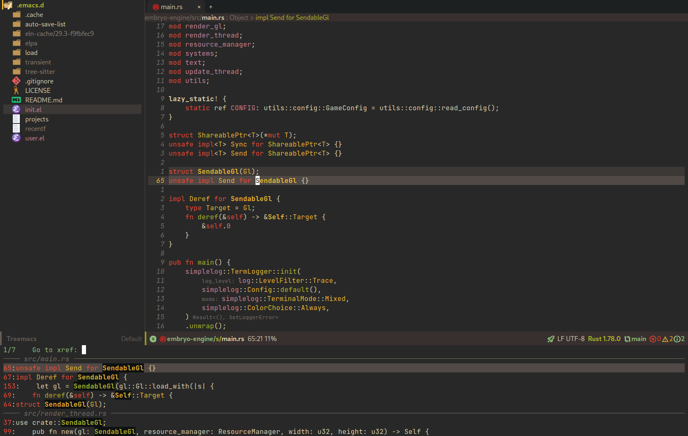

<div align="center">
  
  <h1>Quake Emacs</h1>
  <p>Lean, fast, focused, and based on the latest Emacs tech</p>
</div>

<p align="center">

</p>

---

## Why?

If you want to use Emacs, but you also:

- just want to sit down and have your shiny new editor work *right away*, and
- don't want the complexity, abstraction, and isolation of an Emacs distribution,

then Quake Emacs is for you.

## How to install

1. First, you install Quake Emacs like usual:

```bash
git clone https://github.com/alexispurslane/quake-emacs.git ~/.emacs.d
```

2. Then copy the example `user.el` provided with Quake to your Quake Emacs configuration directory at `~/.quake.d/user.el`:

```bash
mkdir -p ~/.quake.d/ && cp user.el ~/.quake.d/
```

To update, just `git pull` to the latest tag.

## Key Features

- 🎯 **Lean and focused**: Quake Emacs includes just the packages and configuration you need for a beautiful, modern IDE-lite experience when coding and a focused, ergonomic experience when writing, and *nothing else*. Consider Quake Emacs part of your editor — it's just there to give you a good out of the box experience, like [Helix](https://helix-editor.com/). The rest is up to you! 
- 🚀 **Fast**: Every single package is carefully chosen with performance and memory usage partly in mind, and the default load order is tuned within an inch of its life to ensure Emacs starts as fast as possible. (On my machine, Quake Emacs loads in 0.66 seconds with icons turned off and 0.72 with them turned on, and Doom loads in 0.78, for comparison.)
- 🥇 **Just one single file**: The configuration framework itself is only one simple, clear, few-hundred line file, and that's it. No thousands of lines of Lisp scattered throughout hundreds of files across interminable layers of abstraction. If you want to know where something is, or how it works, it's easy to find, and the configuration framework is as self-contained as it gets. Just plop the file down, create a user config file, and it'll build itself up for you.
- 🌐 **Vanilla-first**: Quake Emacs prioritizes using packages that integrate well with existing Emacs functionality, and with each other, and only introduces layers of abstraction over built-in vanilla Emacs when *absolutely necessary*. Vanilla Emacs instructions should still work in Quake Emacs!
- 🖱 **GUI-maximalist**: One of Emacs's most unique features as an editor is its ability to combine the compactness, focus, and performance of a text-mode interface with embedded images, multiple fonts and font sizes, etc to give you a modern editor experience. Quake Emacs is designed to maximize its use of that right out of the box!

## Justification

With the introduction of various modern Emacs features in the last few years, and the emergence of a new generation of Emacs packages focused on integrating with vanilla Emacs, Emacs distributions as we have known them are less and less relevant.

Now that `use-package` is included with Emacs by default, configuration frameworks are less necessary then ever, as vanilla Emacs's built-in capabilities are likely clearer, faster, and more powerful than whatever a configuration framework could offer, with the benefit of also being the community standard. In my experience, Doom Emacs's ideosyncratic package management system was less clear, less-organized, less-documented, and much less reliable than what is now built into Emacs 29.

Likewise, with the inclusion of `eglot` and `tree-sitter`, language-specific "layers" that compose five or six packages, together with a lot of configuration, in order to give a decent experience, are mostly a thing of the past. Quake Emacs leverages these powerful built-in modern Emacs features to give you the experience of an Emacs configuration framework and distribution, without all the downsides.

Similarly, with the creation of amazing packages like `vertico`, `orderless`, and `confu`, the need to manually integrate added features from various packages into your Emacs system and other Emacs packages is basically obsolete: these packages integrate directly with Emacs, by hooking into or outright replacing Emacs's built in functions for performing various actions, so there's no need to do anything. As a result, much of the configuration work Emacs distributions needed to do to wire everything up simply doesn't need to be done.

## Screenshots

> [!NOTE]
> Some of these screenshots were taken with icons off, and some with them on.

Quake Emacs has fast autocompletion with [Corfu](https://elpa.gnu.org/packages/doc/corfu.html) and Orderless enabled everywhere.


Full autocompletion even works in the Lisp Eval line (`M-:`). It's a real repl, so why not have a real coding experience in it?


Fuzzy searching with [Vertico](https://github.com/minad/vertico), [Marginalia](https://github.com/minad/marginalia), [Consult](https://github.com/minad/consult) and [Orderless](https://github.com/oantolin/orderless) is enabled in every selection menu and prompt. 


Quake Emacs has an optionally pretty rich GUI with inclusion of [Centaur Tabs](https://github.com/ema2159/centaur-tabs) and [Treemacs](https://github.com/Alexander-Miller/treemacs) (only loaded when requested, so if you don't use them, you don't pay for them), both configured to look their best. (Also notice [hydra](https://github.com/abo-abo/hydra?tab=readme-ov-file), [which-key](https://github.com/abo-abo/hydra?tab=readme-ov-file), and my meticulous [evil-mode](https://github.com/emacs-evil/evil) leader key keybindings, made with [general](https://github.com/noctuid/general.el)).


But Quake Emacs is also minimal and focused by default, if you prefer.


While also offering IDE-class features besides completion, via [Eglot](https://github.com/joaotavora/eglot), [eldoc-box](https://github.com/casouri/eldoc-box), [tree-sitter](https://www.emacswiki.org/emacs/Tree-sitter), and [treesit-auto](https://github.com/renzmann/treesit-auto).




Inspired by [DOOM Emacs](https://github.com/doomemacs/doomemacs) and [MinEmacs](https://github.com/abougouffa/minemacs/tree/main) (I owe the basic leader key configuration to MinEmacs).